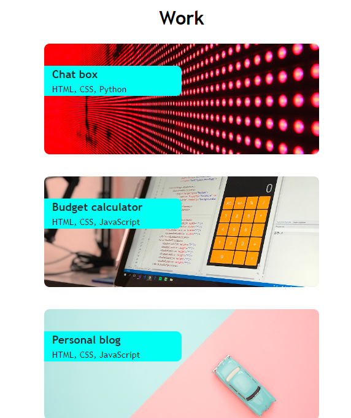

# My portfolio website assignment

## One possible version of my future portfolio website

- I have built this website as a starting point to my portfolio.
- **Mobile view:**
    
    
    

- **Tablet view:**
    
    
    

- **Desktop view**:
    
    
    

- purpose of this project - to practice CSS: flexbox, grid, make them work together.
- when user hovers over navigation and Github link, the text gets underlined.
- when navigation link is clicked, it takes user to relevant section.
- when Resume link is clicked, it takes user to my Github site(it opens in new window) where user can download my Resume PDF file.
- when user mouse hovers over project tile, it gives impression the card is lifted.
- when user clicks on the project card, it takes to external website, link opens in new window.
- when user clicks on GitHub link in contact section, it opens in new window ant takes to my GitHub page. 

## My observation
- what I learned that it is worth to take time in the beginning and plan how I will achieve the desired results, which properties I will use.
-  when building next similar project, it is worth to start coding from mobile view first, and desktop after.
-  for some reason my profile image was not working on GitHub pages. I tried: rename it(case sensitive), move image to root level, write path in different ways, but nothing worked, this single image was not dispalying on the page(I only can see alt text and image icon). Thats why I created my-portfolio-assignment2 repository, uploaded all files here, deployed to Github pages and image is properly displaying now.

## Installation

No installation needed.

## Usage

Please click this [link](https://astarem.github.io/my-portfolio-assignment2/) to review deployed project.

